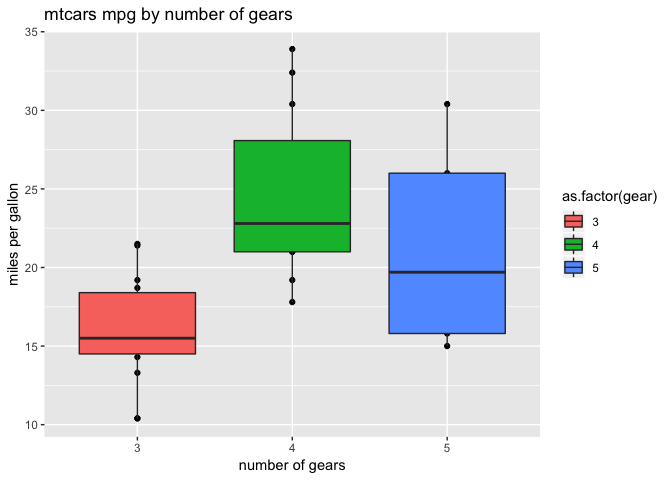
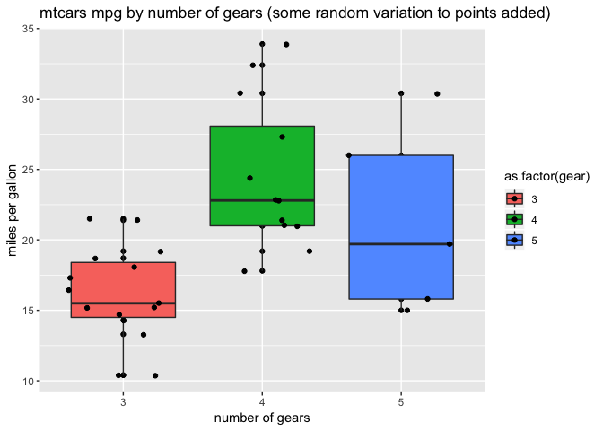
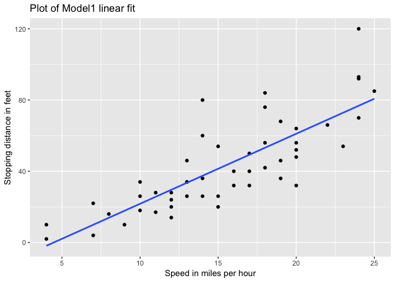
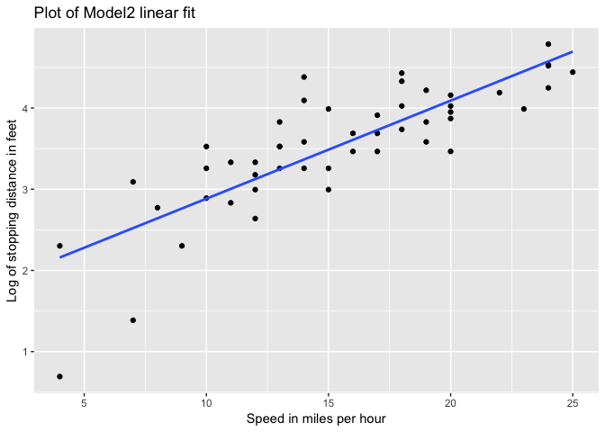
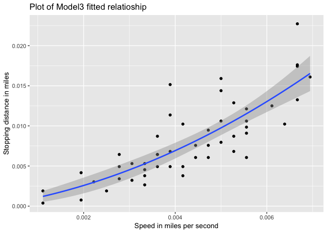

---
output:
  html_document:
    keep_md: yes
  word_document: default
  pdf_document: default
---
---
#Advanced Bioinformatics 2019 assessment
###Candidate number 8941

15/09/2019


####Task 1

```r
sum(5:55)
```

```
## [1] 1530
```

####Task 2

```r
sumfun <- function(n){return (sum (5:n)) }

sumfun(10)
```

```
## [1] 45
```

```r
sumfun(20)
```

```
## [1] 200
```

```r
sumfun(100)
```

```
## [1] 5040
```


####Task 3

```r
Fibonacci <- numeric(12)
Fibonacci[1] <- Fibonacci[2] <- 1
for (i in 3:12) Fibonacci[i] <- Fibonacci[i-2] + Fibonacci[i-1]
print(Fibonacci)
```

```
##  [1]   1   1   2   3   5   8  13  21  34  55  89 144
```

####Task 4

```r
library(ggplot2)
str(mtcars)
```

```
## 'data.frame':	32 obs. of  11 variables:
##  $ mpg : num  21 21 22.8 21.4 18.7 18.1 14.3 24.4 22.8 19.2 ...
##  $ cyl : num  6 6 4 6 8 6 8 4 4 6 ...
##  $ disp: num  160 160 108 258 360 ...
##  $ hp  : num  110 110 93 110 175 105 245 62 95 123 ...
##  $ drat: num  3.9 3.9 3.85 3.08 3.15 2.76 3.21 3.69 3.92 3.92 ...
##  $ wt  : num  2.62 2.88 2.32 3.21 3.44 ...
##  $ qsec: num  16.5 17 18.6 19.4 17 ...
##  $ vs  : num  0 0 1 1 0 1 0 1 1 1 ...
##  $ am  : num  1 1 1 0 0 0 0 0 0 0 ...
##  $ gear: num  4 4 4 3 3 3 3 4 4 4 ...
##  $ carb: num  4 4 1 1 2 1 4 2 2 4 ...
```

```r
ggplot(mtcars, aes(x = as.factor(gear), y = mpg, fill = as.factor(gear)))+
  geom_point()+
  geom_boxplot()+
  labs(x='number of gears', y='miles per gallon', title='mtcars mpg by number of gears')
```

<!-- -->


```r
#with a small amount of random variation added to the points because of small dataset
library(ggplot2)
ggplot(mtcars, aes(x = as.factor(gear), y = mpg, fill = as.factor(gear)))+
  geom_point()+
  geom_boxplot()+
  geom_jitter()+
  labs(x='number of gears', y='miles per gallon', title='mtcars mpg by number of gears (some random variation to points added)')
```

<!-- -->

####Task 5

```r
str(cars)
```

```
## 'data.frame':	50 obs. of  2 variables:
##  $ speed: num  4 4 7 7 8 9 10 10 10 11 ...
##  $ dist : num  2 10 4 22 16 10 18 26 34 17 ...
```

```r
summary(cars)
```

```
##      speed           dist       
##  Min.   : 4.0   Min.   :  2.00  
##  1st Qu.:12.0   1st Qu.: 26.00  
##  Median :15.0   Median : 36.00  
##  Mean   :15.4   Mean   : 42.98  
##  3rd Qu.:19.0   3rd Qu.: 56.00  
##  Max.   :25.0   Max.   :120.00
```

```r
# Model1
#variable speed centered around its mean (using generic scale funcion) to avoid nonesense negative values
set.seed(1)
speed.c = scale(cars$speed, center = TRUE, scale = FALSE)
model1 = lm(formula = dist~speed.c, data = cars)
summary(model1)
```

```
## 
## Call:
## lm(formula = dist ~ speed.c, data = cars)
## 
## Residuals:
##     Min      1Q  Median      3Q     Max 
## -29.069  -9.525  -2.272   9.215  43.201 
## 
## Coefficients:
##             Estimate Std. Error t value Pr(>|t|)    
## (Intercept)  42.9800     2.1750  19.761  < 2e-16 ***
## speed.c       3.9324     0.4155   9.464 1.49e-12 ***
## ---
## Signif. codes:  0 '***' 0.001 '**' 0.01 '*' 0.05 '.' 0.1 ' ' 1
## 
## Residual standard error: 15.38 on 48 degrees of freedom
## Multiple R-squared:  0.6511,	Adjusted R-squared:  0.6438 
## F-statistic: 89.57 on 1 and 48 DF,  p-value: 1.49e-12
```
##### fitted slope in Model1 is 3.932 with standard deviation of 0.415
##### intercept of the line is 42.98 with standard deviation of 2.175


```r
# Model2 
#optimisation with log transformation of variable distance
set.seed(1)
speed.c = scale(cars$speed, center = TRUE, scale = FALSE)
model2 = lm(formula = log(dist)~speed.c, data = cars)
summary(model2)
```

```
## 
## Call:
## lm(formula = log(dist) ~ speed.c, data = cars)
## 
## Residuals:
##      Min       1Q   Median       3Q      Max 
## -1.46604 -0.20800 -0.01683  0.24080  1.01519 
## 
## Coefficients:
##             Estimate Std. Error t value Pr(>|t|)    
## (Intercept)  3.53591    0.06312   56.02  < 2e-16 ***
## speed.c      0.12077    0.01206   10.02 2.41e-13 ***
## ---
## Signif. codes:  0 '***' 0.001 '**' 0.01 '*' 0.05 '.' 0.1 ' ' 1
## 
## Residual standard error: 0.4463 on 48 degrees of freedom
## Multiple R-squared:  0.6763,	Adjusted R-squared:  0.6696 
## F-statistic: 100.3 on 1 and 48 DF,  p-value: 2.413e-13
```
##### fitted slope in Model2 is 0.120 with standard deviation of 0.012
##### intercept of the line is 3.535 with standard deviation of 0.063


####Task 6

```r
# Model1 plot
library(ggplot2)
ggplot(cars, aes(x = speed, y = dist))+
  geom_point()+
  labs(x='Speed in miles per hour', y='Stopping distance in feet', title='Plot of Model1 linear fit')+
  stat_smooth(method = lm, se = FALSE)
```

<!-- -->

```r
# Model2 plot
library(ggplot2)
ggplot(cars, aes(x = speed, y = log(dist)) )+
  geom_point()+
  labs(x='Speed in miles per hour', y='Log of stopping distance in feet', title='Plot of Model2 linear fit')+
  stat_smooth(method = lm, se = FALSE)
```

<!-- -->


####Task 7

```r
library(dplyr)
```

```
## 
## Attaching package: 'dplyr'
```

```
## The following objects are masked from 'package:stats':
## 
##     filter, lag
```

```
## The following objects are masked from 'package:base':
## 
##     intersect, setdiff, setequal, union
```

```r
#manipulating data in cars to create new columns with speed in miles per second and stopping distance in miles
carsM <- mutate (cars, speedM = speed/3600, distM = dist/5280)
str(carsM)
```

```
## 'data.frame':	50 obs. of  4 variables:
##  $ speed : num  4 4 7 7 8 9 10 10 10 11 ...
##  $ dist  : num  2 10 4 22 16 10 18 26 34 17 ...
##  $ speedM: num  0.00111 0.00111 0.00194 0.00194 0.00222 ...
##  $ distM : num  0.000379 0.001894 0.000758 0.004167 0.00303 ...
```

```r
#now doing linear regression with new data to relate stopping distance to speed and square of speed
set.seed(1)
model3 = lm(formula = distM~0 + speedM + I(speedM^2), data = carsM)
summary(model3)
```

```
## 
## Call:
## lm(formula = distM ~ 0 + speedM + I(speedM^2), data = carsM)
## 
## Residuals:
##        Min         1Q     Median         3Q        Max 
## -0.0054614 -0.0017180 -0.0005970  0.0008655  0.0085201 
## 
## Coefficients:
##             Estimate Std. Error t value Pr(>|t|)   
## speedM        0.8448     0.3818   2.213  0.03171 * 
## I(speedM^2) 221.2497    72.1371   3.067  0.00355 **
## ---
## Signif. codes:  0 '***' 0.001 '**' 0.01 '*' 0.05 '.' 0.1 ' ' 1
## 
## Residual standard error: 0.002845 on 48 degrees of freedom
## Multiple R-squared:  0.9133,	Adjusted R-squared:  0.9097 
## F-statistic: 252.8 on 2 and 48 DF,  p-value: < 2.2e-16
```

####the estimated average reaction time which appears reasonable is 0.8448 seconds


```r
#ggplot of data points and fitted reltionship is model3 plot

library(ggplot2)
ggplot(carsM, aes(x = speedM, y = distM))+
  geom_point()+
  geom_smooth (method="lm", formula = "y~0+x+I(x^2)")+
  labs(x='Speed in miles per second', y='Stopping distance in miles', title='Plot of Model3 fitted relatioship')
```

<!-- -->


